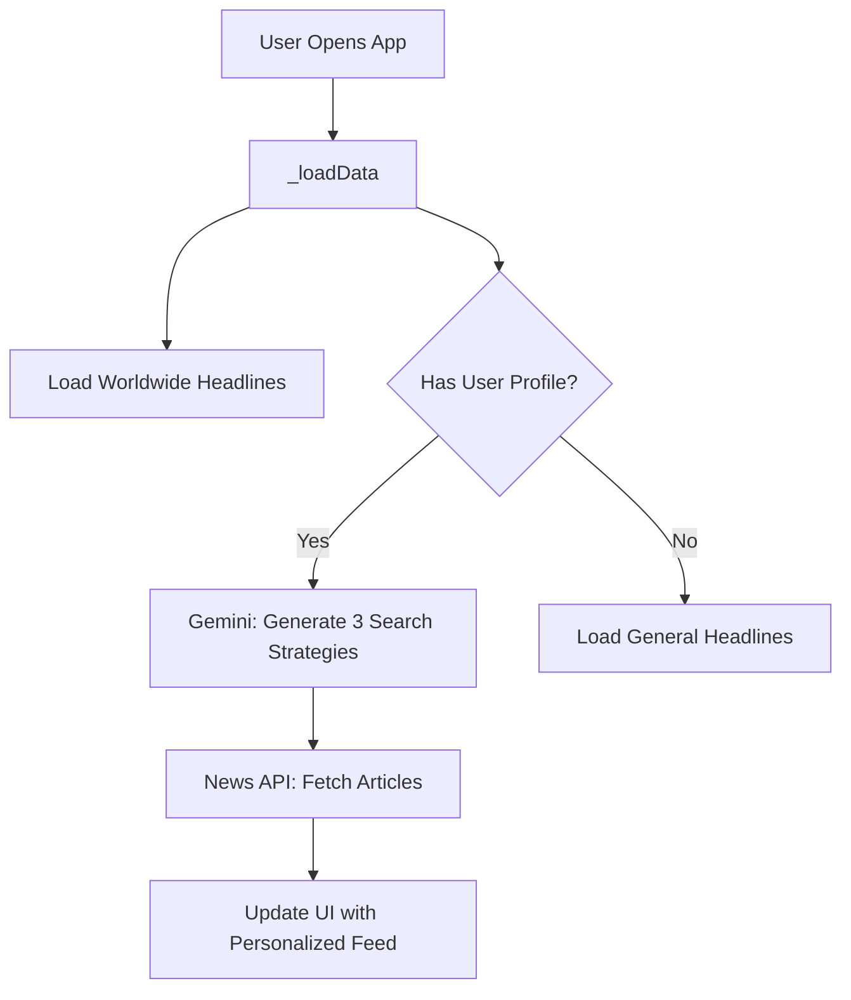

  </img>

# Παρουσίαση εφαρμογής factual

## 1. Εγκατάσταση και Χρήση (Installation)

### Απαιτήσεις Συστήματος
*   **Android Version**: Android 8.0 (Oreo) ή νεότερο.
*   **Απαιτούμενα Services**: Google Play Services (για χάρτες και τοποθεσία).
*   **Σύνδεση**: Απαιτείται ενεργή σύνδεση στο διαδίκτυο.

### Οδηγίες Εγκατάστασης
1.  Εντοπίστε το αρχείο `factual_release.apk` που περιλαμβάνεται στον κεντρικό φάκελο (root) αυτού του πακέτου.
2.  Μεταφέρετε το αρχείο στη συσκευή σας Android.
3.  Ανοίξτε το αρχείο για να ξεκινήσει η εγκατάσταση.
    *   *Σημείωση: Αν ζητηθεί, ενεργοποιήστε την "Εγκατάσταση από άγνωστες πηγές" στις ρυθμίσεις της συσκευής.*
4.  Μόλις ολοκληρωθεί, ανοίξτε την εφαρμογή "factual".

### Χρήση
*   **Είσοδος**: Μπορείτε να συνδεθείτε ως Επισκέπτης (Continue as Guest) για άμεση πρόσβαση.
*   **Αρχική Οθόνη**: Δείτε τα κορυφαία νέα και την προσωποποιημένη ροή σας.
*   **Αναζήτηση**: Χρησιμοποιήστε τη μπάρα αναζήτησης ή το μικρόφωνο για να ρωτήσετε οτιδήποτε.
*   **Ιστορικό/Ρυθμίσεις**: Προσβάσιμα από το μενού στην κορυφή.

---

## 2. Figma Design

Τα περισσότερα wireframes εφαρμόστηκαν. Κάποια έχουν πιλοτική χρήση, ενώ κάποια άλλα έχουν πλήρως λειτουργικά features (history, news search, LLM prompting). 

*   **Authentication**: Λειτουργεί με "Continue as Guest" ή με Firebase account (authorized).
*   **UI/UX**: Υπάρχει μία μικρή διαφορά στο wireframe της ανάλυσης νέων. Επειδή υπήρχε overflow στο design, το landing page για την ανάλυση δεν περιέχει το history left sidebar. Σε κάποιες περιπτώσεις (resize) μπορεί να εμφανιστεί overflow, το οποίο διορθώνεται με restart ή σε επόμενα updates.

---

## 3. Αλγόριθμος Προσαρμοστικής Ροής (Adaptive Feed)

Η Προσαρμοστική Ροή (Adaptive Feed) αποτελεί τον κεντρικό μηχανισμό εξατομίκευσης της εφαρμογής factual. Προτείνει δυναμικά άρθρα με βάση το Ιστορικό, την Τοποθεσία και AI.

### 1. Εναύσματα Ανανέωσης (Refresh Triggers)
*   **Αρχικοποίηση**: Ενεργοποιείται άμεσα (`_loadData()`).
*   **Χειροκίνητα**: Pull-to-refresh.
*   **Ρητή Εναλλαγή**: Επιλογή "Personalized Feed" στις ρυθμίσεις.

### 2. Είσοδοι & Πηγές Δεδομένων

#### Α. Σήματα Χρήστη
| Σήμα | Περιγραφή | Πηγή |
| :--- | :--- | :--- |
| **Ιστορικό Ανάγνωσης** | Άρθρα που έχει ανοίξει ο χρήστης | Firestore / Local SQLite |
| **Ιστορικό Αναζήτησης** | Ερωτήματα χρήστη | Firestore / Local SQLite |
| **Τοποθεσία** | Κωδικός χώρας (π.χ. 'gr') | Συσκευή |
| **Βαθμολογίες** | Χάρτης συχνότητας θεμάτων | Firestore / Local SQLite |

#### Β. Εξωτερικά Endpoints
*   **News API (NewsData.io)**: Λήψη ακατέργαστων δεδομένων.
*   **Google Gemini (GenAI)**: `gemini-2.0-flash` για ανάλυση πλαισίου.
*   **Firebase Firestore**: Συγχρονισμός προφίλ.

---

### 3. Ο Αλγόριθμος (Βήμα προς Βήμα)

1.  **Ανάκτηση Προφίλ**: Το `UserActivityService` ανακτά τα top interests από Firestore ή SQLite.
    *   *Σημείωση*: Ο έλεγχος ύπαρξης προφίλ βασίζεται στο **Firebase Anonymous Authentication**. Τα δεδομένα που αποθηκεύονται τοπικά (user cached data) συγχρονίζονται με το Cloud Firestore σε κάθε ανώνυμη συνεδρία, εξασφαλίζοντας τη συνέχεια της εμπειρίας.
2.  **Δημιουργία Παραμέτρων (AI Agent)**: Το Gemini παράγει 3 ερωτήματα:
    *   *Direct Mix* (Άμεση Μίξη)
    *   *Tangential* (Εφαπτομενικά)
    *   *Discovery* (Ανακάλυψη)
3.  **Λήψη Περιεχομένου**: 3 παράλληλες κλήσεις στο News API.
4.  **Συγχώνευση & Καθαρισμός**: Αφαίρεση διπλότυπων.
5.  **Εμπλουτισμός (Post-Load)**: Background analysis (`loadGlobalContexts`) για Spread Velocity & Summary.

---

### 4. Διάγραμμα Ροής

> **Αναλυτική Τεκμηρίωση**: Για περισσότερες λεπτομέρειες σχετικά με τον αλγόριθμο, δείτε το έγγραφο [Algorithm Documentation](docs/feed_algorithm.md).

## 4. Αρχιτεκτονική Firebase

Τα δεδομένα του Firebase αποθηκεύονται στο **Cloud Firestore**, ενώ η εφαρμογή χρησιμοποιεί **Firebase Anonymous Authentication**. Αυτό σημαίνει ότι δημιουργείται ένα μοναδικό, ανώνυμο προφίλ για κάθε χρήστη χωρίς να απαιτείται Login. Η δραστηριότητα (π.χ. ιστορικό αναζήτησης) καταγράφεται τοπικά (Local SQLite) και συγχρονίζεται με το Cloud μόλις επιτευχθεί σύνδεση, επιτρέποντας εξατομικευμένη ροή ειδήσεων.

---

## 5. SR Editorial Protocol (System Prompts)

### I. CORE STANDARDS & ETHICS (The "SR Model")
*   **Tier 1**: Primary Sources & Official Data (Highest weight).
*   **Tier 2**: Public Service & Established Agencies (High weight).
*   **Tier 3**: Commercial News Media (Medium weight).

### II. OPERATIONAL INSTRUCTIONS: UTILITIES

#### UTILITY A: Single Article Analysis
**Trigger:** User clicks a specific news article.
**Output Goal:** Contextualize the article's reliability.
1.  **Source Audit:** Identify publisher tier.
2.  **Claim Extraction:** Isolate core factual claims.
3.  **Cross-Reference:** Check against Tier 1/2 sources.
4.  **Divergence Analysis:** Highlight differences from consensus.

#### UTILITY B: User Query / Fact-Check
**Trigger:** User types a prompt (e.g., "Is it true...?").
**Output Goal:** Direct, verified answer with graded certainty.
1.  **Search Phase:** Retrieve info from Tier 1/2 sources.
2.  **Synthesis:**
    *   *Agree*: State as fact.
    *   *Disagree*: State controversy.
    *   *Unverified*: "No credible evidence."
3.  **Tone**: Clinical, non-judgmental.

#### UTILITY C: Global News Fetch & Reproduction Graph
**Trigger:** System fetches trending global article.
**Output Goal:** Summary + HTML Visualization.
1.  **Summarization**: <100 word abstract using neutral language.
2.  **HTML Reproduction Graph**: Standalone HTML/JS block plotting spread velocity (X: Time, Y: Volume).

---

## 6. API Keys & Configuration (Για τον καθηγητή)

Η εφαρμογή περιλαμβάνει ενσωματωμένα API Keys για λόγους επίδειξης (Demo/Review mode).
*   **Google Gemini API Key**: Βρίσκεται στο `lib/constants.dart`.
*   **NewsData.io API Key**: Βρίσκεται στο `lib/services/news_service.dart`.
*   **Firebase**: Το αρχείο `google-services.json` είναι ενσωματωμένο.

Δεν απαιτείται καμία ενέργεια από πλευράς σας για την ενεργοποίηση των κλειδιών.

---

## 7. Repository Guidelines

*   **Repository URL**: [https://github.com/panteleimon-a/factual](https://github.com/panteleimon-a/factual)
*   **Android App Branch**: Ο κώδικας της Android εφαρμογής βρίσκεται στο **`main`** branch (και στο `android-app` branch).
*   **Release Tag**: Η έκδοση που αντιστοιχεί στο `factual_release.apk` είναι το tag **`v1.0-demo`**.
