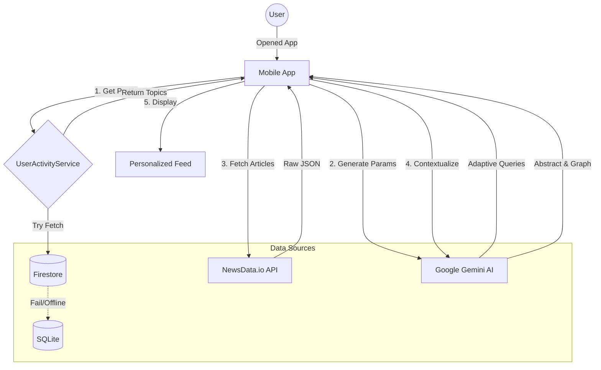

# Adaptive Feed Algorithm Documentation

## Overview
The **Adaptive Feed** is the core personalization engine of the Factual app. It dynamically curates news articles based on User History, Location, and Real-time trends using a hybrid of Local SQLite, Firebase Cloud Store, and Generative AI.

## 1. Refresh Triggers
The feed generates and updates in the following scenarios:
*   **App Initialization**: Triggered immediately when `HomeScreen` mounts via `_loadData()`.
*   **Manual Trigger**: Can be re-triggered by pulling down the refresh indicator (if implemented) or restarting the app.
*   **Explicit Toggle**: When the user toggles "Personalized Feed" in settings (logical switch).

## 2. Inputs & Data Sources

### A. User Signals
*   **Read History**: Articles the user has opened (tracked in `user_interactions`).
*   **Search History**: Queries the user has typed (tracked in `search_queries`).
*   **Location**: Current Country Code (e.g., 'us', 'gr') for regional safeguards.
*   **Interest Scores**: A weighted frequency map of topics (e.g., `{'Technology': 15, 'Politics': 5}`).
    *   *Source*: Fetched from **Firestore** (`users/{userId}/interest_scores`) or **Local SQLite** if offline.

### B. External Endpoints
1.  **News API (NewsData.io)**:
    *   Endpoint: `https://newsdata.io/api/1/news`
    *   Role: Fetches the raw article data.
2.  **Google Gemini (Generative AI)**:
    *   Model: `gemini-2.0-flash`
    *   Role: Generates search parameters and analyzes context.
3.  **Firebase Firestore**:
    *   Collection: `users`
    *   Role: Stores and retrieves cross-device interest profiles.

## 3. The Algorithm (Step-by-Step)

### Step 1: Profile Retrieval
The app requests `UserActivityService.getTopInterests(userId)`.
*   **Primary**: Tries to fetch `interest_scores` from Firestore.
*   **Fallback**: If network fails or data is empty, queries local SQLite `user_interactions`.
*   **Result**: A list of top 5 topics (e.g., `["AI", "Space", "Crypto", "Physics", "Startup"]`).

### Step 2: Parameter Generation (AI Agent)
If topics exist, `LLMService.generateAdaptiveFeedParams` is called with the user's top interests.
Gemini is prompted to act as a "News Curator" and generate 3 distinct search queries:
1.  **Direct Mix**: A combination of top interests (e.g., "AI in Space Industry").
2.  **Tangential**: A related trending topic (e.g., "Quantum Computing").
3.  **Discovery**: A wildcard relevant to their taste but new (e.g., "Tech Regulation Policy").

### Step 3: Content Fetching
`NewsProvider` executes 3 parallel calls to the **News API** using the AI-generated queries.
*   *Note*: If the user has no history, it defaults to `getTopHeadlines(category: 'general')`.

### Step 4: Merge & Deduplicate
*   The results from the 3 queries are merged into a single list.
*   Exact duplicates (by URL or Title) are removed.
*   **Result**: A list of 10-30 unique, highly relevant articles.

### Step 5: Context Enrichment (Post-Load)
Once the feed is displayed, a background process (`loadGlobalContexts`) triggers for the top 10 articles:
*   Gemini analyzes the article content.
*   Generates the **"Spread Velocity"** graph data (Reproduction Graph).
*   Generates a **Neutral Abstract**.
*   This creates the "Deep Analysis" view without blocking the initial UI load.

## 4. Outputs
*   **UI**: Populates the `Vertical News List` on the Home Screen.
*   **State**: Updates `NewsProvider.articles` and `NewsProvider.globalContexts`.

## 5. Flow Diagram
User Opens App -> `_loadData()`
   |
   +-> [1] Load Worldwide Headlines (Immediate UI)
   |
   +-> [2] Async: Fetch Interest Profile (Firestore/SQLite)
          |
          v
       [3] Gemini: Generate 3 Query Strategies
          |
          v
       [4] News API: Fetch Articles for Queries
          |
          v
       [5] UI Update: Replace Worldwide with Personalized Feed

## 6. Visual Data Flow (Mermaid)

